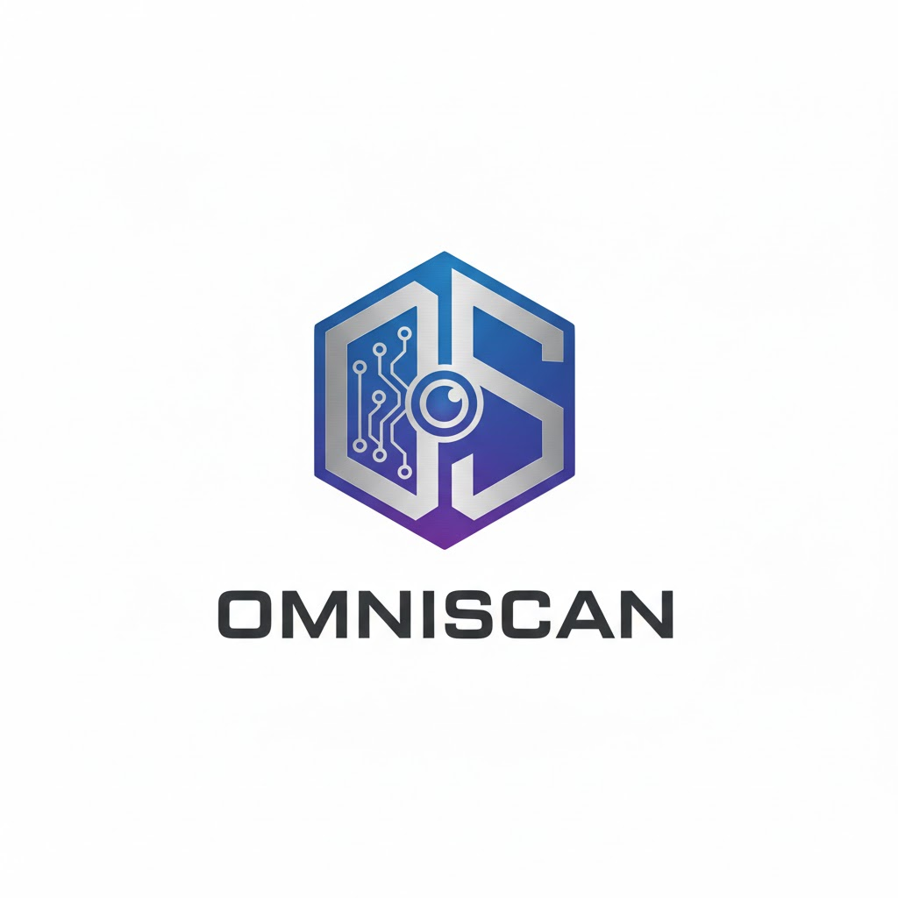

<div align="center">
  <a href="https://github.com/drondeseries/omniscan">
    <picture>
      <source media="(prefers-color-scheme: dark)" srcset="assets/logo.png" width="200">
      
    </picture>
  </a>
</div>

<div align="center">
  <a href="https://github.com/drondeseries/omniscan/stargazers"></a>
  <a href="https://github.com/drondeseries/omniscan/issues"></a>
  <a href="https://github.com/drondeseries/omniscan/blob/main/LICENSE"></a>
  <a href="https://discord.gg/vMSnNcd7m5"></a>
</div>

<h1 align="center">Omniscan</h1>
<p align="center"><b>The Modern Media Health & Sync Manager for Plex, Emby, and Jellyfin.</b></p>

Omniscan bridges the gap between your media files and your media server. It monitors your filesystem for changes, validates file integrity, and triggers targeted library scans only when necessary.

<div align="center">
</div>

## ✨ Features

- **🕸️ Modern Web Dashboard:** A beautiful, responsive UI to monitor your media health in real-time.
- **🏥 Health & Integrity Check:** Detects corrupt files, 0-byte placeholders, and incomplete downloads before they ruin movie night.
- **⚡ Smart Webhook Triggers:** Seamless integration with **Sonarr** and **Radarr**. It intelligently debounces hundreds of incoming requests into efficient, sequential scans.
- **📁 File Browser:** Explore your mounted media folders and trigger manual scans for specific directories directly from the UI.
- **📜 Live Logs:** Watch real-time logs via WebSocket (with polling fallback) to debug issues instantly.
- **🔔 Discord Notifications:** Get beautiful summary reports of added, deleted, and corrupt content.
- **🐳 Docker Ready:** Built for containerized environments.

---

## 🚀 Getting Started

### Option 1: Docker Compose (Recommended)

1.  **Create a `docker-compose.yml` file:**

```yaml
version: "3.8"
services:
  omniscan:
    image: ghcr.io/drondeseries/omniscan:latest
    container_name: omniscan
    restart: unless-stopped
    ports:
      - "8085:8000"
    environment:
      - PUID=1000
      - PGID=1000
      - TZ=America/New_York
    volumes:
      - ./config:/app/config
      - /mnt/media:/media:ro  # Mount your media read-only
```

2.  **Start the container:**
    ```bash
    docker-compose up -d
    ```

3.  **Access the Dashboard:**
    Open `http://<your-ip>:8085` in your browser. Default login: `admin` / (password generated in logs on first run).

### Option 2: Manual Installation (Python 3.11+)

1.  Clone the repo:
    ```bash
    git clone https://github.com/drondeseries/omniscan.git
    cd omniscan
    ```
2.  Install dependencies:
    ```bash
    pip install -r requirements.txt
    ```
3.  Run the application:
    ```bash
    python omniscan.py
    ```

---

## ⚙️ Configuration

You can configure everything directly from the **Web UI > Settings** tab.

### Media Server Setup
*   **Plex:** Enter your Plex URL (e.g., `http://192.168.1.50:32400`) and Token.
*   **Emby/Jellyfin:** Select your server type, enter the URL and API Key.

### Scan Behavior
*   **Scan Paths:** The local paths inside the container (e.g., `/media/movies`) that Omniscan should watch.
*   **Debounce:** Time (in seconds) to wait for file operations to settle before triggering a scan (default: 10s).
*   **Workers:** Number of parallel threads for file hashing and verification.

---

## 🔗 Webhook Integration (*Arr Suite)

Omniscan creates a unified webhook endpoint to handle high-volume imports from Sonarr, Radarr, or Autoscan without crashing your server.

**Endpoint:** `POST http://<omniscan-ip>:8085/api/webhook`

### Setup in Sonarr / Radarr
1.  Go to **Settings > Connect**.
2.  Click **+** and choose **Webhook**.
3.  **Name:** Omniscan
4.  **Webhook URL:** `http://<your-omniscan-ip>:8085/api/webhook`
5.  **Method:** POST
6.  **Triggers:** Check `On Download`, `On Upgrade`, `On Rename`.
7.  **Save**.

### JSON Payload Examples
Omniscan automatically parses payloads from common tools. You can also send a generic request:

```json
{
  "path": "/media/movies/Avatar (2009)"
}
```

---

## 🛠️ Troubleshooting

### Live Logs
The **Live Logs** tab connects via WebSocket. If you are behind a reverse proxy (Nginx/Cloudflare) and WebSockets fail, Omniscan automatically falls back to HTTP polling.

### Health Checks
If a file is marked **Corrupt**, it usually means:
1.  The file size is 0 bytes.
2.  The file header/footer is missing (incomplete download).
3.  `ffprobe` failed to read metadata.

Click on the **Corrupt** box in the Dashboard to see a filtered history of failed files.

---

## 🤝 Contributing

We welcome contributions! Please open an issue or submit a PR.

1.  Fork the Project
2.  Create your Feature Branch (`git checkout -b feature/AmazingFeature`)
3.  Commit your Changes (`git commit -m 'Add some AmazingFeature'`)
4.  Push to the Branch (`git push origin feature/AmazingFeature`)
5.  Open a Pull Request

## 📄 License

Distributed under the MIT License. See `LICENSE` for more information.

---

## 🙏 Acknowledgments

*   **[Pukabyte/rescan](https://github.com/Pukabyte/rescan)** - The original project that inspired the logic for missing file detection.
*   **[PlexAPI](https://github.com/pkkid/python-plexapi)** - Powering the deep integration with Plex servers.
*   **[FastAPI](https://fastapi.tiangolo.com/)** - The high-performance framework behind the Web UI.
*   **[Chart.js](https://www.chartjs.org/)** - For the beautiful health visualization charts.
*   **[Tailwind CSS](https://tailwindcss.com/)** - For the modern, responsive dashboard design.