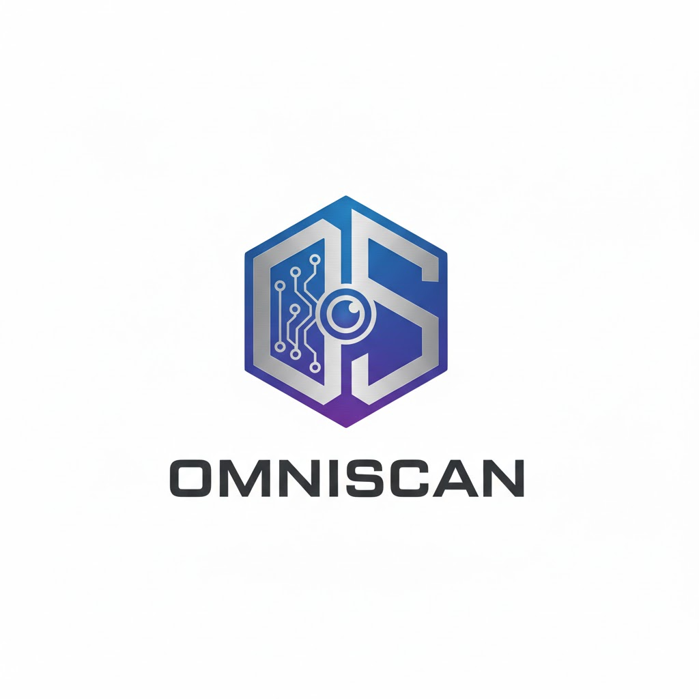

<div align="center">
  <a href="https://github.com/drondeseries/omniscan">
    <picture>
      <source media="(prefers-color-scheme: dark)" srcset="assets/logo.png" width="200">
      
    </picture>
  </a>
</div>

<div align="center">
  <a href="https://github.com/drondeseries/omniscan/stargazers"></a>
  <a href="https://github.com/drondeseries/omniscan/issues"></a>
  <a href="https://github.com/drondeseries/omniscan/blob/main/LICENSE"></a>
</div>

<h1 align="center">Omniscan</h1>
<p align="center"><b>The Modern Media Health & Sync Manager for Plex, Emby, and Jellyfin.</b></p>

Omniscan bridges the gap between your media files and your media server. It monitors your filesystem for changes, validates file integrity, triggers targeted library scans only when necessary, and surfaces missing or stuck files so nothing falls through the cracks.

---

## ✨ Features

- **🕸️ Dark Glass Web Dashboard** — Real-time stat cards (total files, missing, stuck, corrupt), scanner controls, library list, and a paginated events log.
- **📁 Smart File Browser** — Navigate your media directories with pill-style filters: **All Files**, **Missing** (files on disk not in your server), and **Stuck** (files that repeatedly failed to import). Trigger per-file or per-directory scans directly.
- **🚨 Missing File Tracking** — Detects files present on disk that never appeared in Plex/Jellyfin/Emby. Clickable dashboard card links straight to the filtered browser.
- **🔴 Stuck File Detection** — Tracks files that exceeded the max retry limit (default 3). Shows attempt count, last-seen timestamp, and a plain-English reason. Matches the count reported in Discord notifications.
- **🏥 Health & Integrity Check** — Detects corrupt files, 0-byte placeholders, and incomplete downloads before they ruin movie night.
- **⚡ Smart Webhook Triggers** — Seamless integration with **Sonarr** and **Radarr**. Debounces hundreds of incoming requests into efficient, sequential scans.
- **📜 Live Log Viewer** — Level filter (All / Debug / Info / Warning / Error), text search, copy-all, and clear buttons. Auto-refreshes every 2 seconds.
- **🔔 Discord Notifications** — Beautiful summary reports of added, deleted, corrupt, missing, and stuck content.
- **🔒 Reverse Proxy Ready** — `X-Forwarded-Proto` support ensures webhook URLs are shown correctly when behind Nginx/Traefik/Cloudflare.
- **🐳 Docker Ready** — Built for containerised environments with a single `docker-compose.yml`.

---

## 🚀 Getting Started

### Option 1: Docker Compose (Recommended)

1. **Create a `docker-compose.yml`:**

```yaml
services:
  omniscan:
    image: ghcr.io/drondeseries/omniscan:latest
    container_name: omniscan
    restart: unless-stopped
    ports:
      - "8085:8000"
    environment:
      - PUID=1000
      - PGID=1000
      - TZ=America/New_York
    volumes:
      - ./config:/app/config
      - /mnt/media:/media:ro   # Mount your media read-only
```

2. **Start the container:**
   ```bash
   docker compose up -d
   ```

3. **Access the Dashboard:**
   Open `http://<your-ip>:8085` — default login: `admin` / `admin` (change in Settings immediately).

### Option 2: Manual Installation (Python 3.11+)

```bash
git clone https://github.com/drondeseries/omniscan.git
cd omniscan
pip install -r requirements.txt
python omniscan.py
```

---

## ⚙️ Configuration

Everything is configurable from **Settings** in the Web UI, or via `config/config.ini`.

### Media Server

| Field | Description |
|---|---|
| `type` | `plex`, `emby`, or `jellyfin` |
| `server` / `url` | Full URL including port (e.g. `http://192.168.1.50:32400`) |
| `token` / `api_key` | Plex token or Emby/Jellyfin API key |

### Scan Paths

Comma-separated list of local paths **inside the container** that Omniscan should monitor (e.g. `/media/movies,/media/tv`).

### Behaviour

| Setting | Default | Description |
|---|---|---|
| `scan_debounce` | `10` | Seconds to wait for file ops to settle before scanning |
| `scan_workers` | `4` | Parallel threads for hashing/verification |
| `run_interval` | `24` | Hours between full scheduled scans |
| `run_on_startup` | `true` | Run a full scan immediately on start |
| `incremental_scan` | `true` | Only scan files newer than `scan_since_days` |
| `scan_since_days` | `7` | Lookback window for incremental scans |
| `integrity_check` | `false` | Enable basic file header checks |
| `ffprobe_check` | `false` | Enable deep ffprobe validation (CPU-intensive) |
| `deletion_threshold` | `50` | Max files to delete in one pass before aborting |
| `abort_on_mass_deletion` | `true` | Safety: abort scan if deletion threshold exceeded |

### Notifications (Discord)

Set `enabled = true` and provide your `discord_webhook_url`. Omniscan sends a summary after each scan including added, missing, stuck, and corrupt file counts.

---

## 🔗 Webhook Integration (*Arr Suite)

Omniscan exposes a unified, authenticated webhook endpoint for Sonarr, Radarr, Lidarr, and Readarr.

**Endpoint:** `POST http://<omniscan-ip>:8085/api/webhook?apikey=<apikey>`

> [!IMPORTANT]
> The webhook endpoint requires authentication using an API key (`apikey`). Copy the complete, pre-configured URL directly from either the **Dashboard** or the **Settings** page in the Omniscan Web UI. If you are behind a reverse proxy (e.g. `https://omniscan.example.com`), the UI automatically constructs the correct public URL.

### Setup in Sonarr / Radarr

1. Go to **Settings → Connect → +** → choose **Webhook**
2. **Name:** Omniscan
3. **URL:** Paste the complete URL copied from the Omniscan UI (e.g., `http://<omniscan-ip>:8085/api/webhook?apikey=<token>`)
4. **Method:** POST
5. **Triggers:** ✅ On Download, ✅ On Upgrade, ✅ On Rename (Omniscan automatically handles the test connection event during setup)
6. **Save**

### Generic JSON Payload

```json
{ "path": "/media/movies/Avatar (2009)" }
```

---

## 🖥️ Dashboard

| Card | Description |
|---|---|
| **Total Files** | Files currently tracked in your library |
| **Missing Files** | Files on disk that never appeared in the media server — click to browse |
| **Stuck Files** | Files that hit the max retry limit (≥ 3 failed scan attempts) — click to browse |
| **Corrupt Files** | Files that failed integrity or ffprobe checks |

### Browser Filters

| Filter | Shows |
|---|---|
| **All Files** | Full directory tree browser with per-file library status |
| **Missing** | Files on disk absent from Plex/Jellyfin/Emby |
| **Stuck** | Files Plex/Jellyfin/Emby repeatedly failed to import — includes attempt count and reason |

---

## 🛠️ Troubleshooting

### Files showing as Stuck

A file is **Stuck** when it was found on disk, Omniscan triggered a library scan, but the media server still didn't register it after **3+ attempts**. Common causes:

- The file's path isn't mapped correctly inside the media server container
- The media server doesn't support the file format/codec
- The media server is under heavy load and scan jobs are being dropped
- File permissions prevent the media server from reading it

**Fix:** Hit **Scan** to retry, or **Clear** to remove from the stuck list and let it be re-evaluated on the next scan cycle.

### Files showing as Missing

A file is **Missing** when Omniscan found it on disk during a scan cycle but the library cache (loaded from Plex/Jellyfin/Emby at startup) doesn't contain it. This is often transient — it resolves after a scan completes.

### Live Logs show no output

If you're behind a reverse proxy and WebSocket connections fail, check that your proxy is configured to pass `Upgrade: websocket` headers.

### Health Checks

If a file is marked **Corrupt**, it usually means:
1. The file is 0 bytes
2. The file header/footer is missing (incomplete download)
3. `ffprobe` failed to read metadata

---

## 🤝 Contributing

1. Fork the Project
2. Create your Feature Branch (`git checkout -b feature/AmazingFeature`)
3. Commit your Changes (`git commit -m 'Add some AmazingFeature'`)
4. Push to the Branch (`git push origin feature/AmazingFeature`)
5. Open a Pull Request

---

## 📄 License

Distributed under the MIT License. See `LICENSE` for more information.

---

## 🙏 Acknowledgments

- **[Pukabyte/rescan](https://github.com/Pukabyte/rescan)** — The original project that inspired the missing file detection logic.
- **[PlexAPI](https://github.com/pkkid/python-plexapi)** — Deep integration with Plex servers.
- **[NiceGUI](https://nicegui.io/)** — The Python-native UI framework powering the web dashboard.
- **[FastAPI](https://fastapi.tiangolo.com/)** — High-performance async backend.
- **[Font Awesome](https://fontawesome.com/)** — Icons throughout the UI.